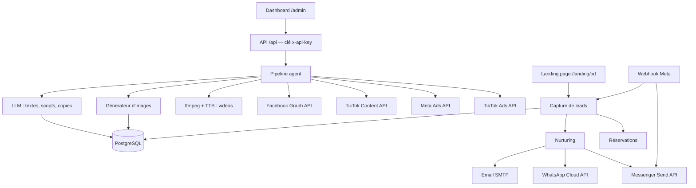
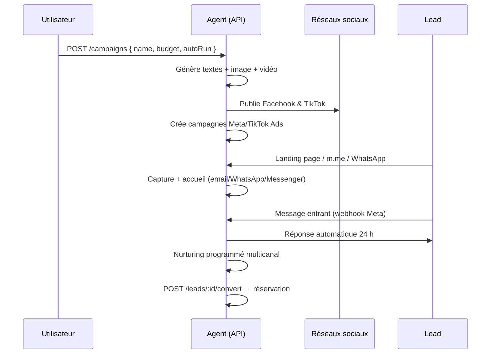

# 🏨 Agent Marketing Hôtel

Agent marketing complet et autonome pour votre hôtel : il génère du contenu (texte, image, vidéo), publie sur Facebook et TikTok, lance des campagnes publicitaires, capture des leads et les convertit en réservations — avec un **nurturing multicanal** (Email, **WhatsApp Business**, **Messenger**).

## Fonctionnalités

| Couche | Capacités |
|---|---|
| **Génération de contenu** | Textes par **LLM multi-fournisseurs** (OpenAI, Claude, Gemini, Groq, Mistral, DeepSeek, OpenRouter, Together, Ollama local), images (DALL·E, SDXL, **Flux** via Replicate/fal/HuggingFace/Together, getimg, local), vidéos (**Wan 2.2 / Hunyuan / Mochi** via Replicate/fal **ou** ffmpeg : Ken Burns + sous-titres + voix off) |
| **Médiathèque** | Collecte automatique des vraies images/vidéos du site (`/media/collect`), import par URL, **upload avec catégories/tags/légendes** — l'agent sélectionne les visuels par pertinence avec le sujet de chaque post |
| **Calendrier éditorial** | Fréquence, horaires, thèmes et **tons propres à chaque plateforme** — l'agent génère automatiquement les posts planifiés de la semaine (textes + médias adaptés) |
| **Ton & relecture** | **Mini-éditeur de ton par campagne** (8 presets : Chaleureux, Luxe, Minimaliste, Dynamique…) appliqué à tous les contenus générés + **relecture automatique des brouillons par l'IA avant publication** (score 0-100, corrections appliquées, blocage sous `REVIEW_MIN_SCORE`) |
| **Aperçu des contenus** | Dashboard : aperçu des posts en carte Facebook ou téléphone TikTok avant publication, lightbox médias |
| **Publication** | Facebook Graph API (posts texte/photo/vidéo, planification), TikTok Content Posting API (upload vidéo + sondage de statut, photos) |
| **Publicité** | Meta Ads API (campagnes, ad sets, créatifs, annonces, ciblage, budgets), TikTok Ads API (campagnes, ad groups, annonces, upload de créatifs) |
| **Inbound** | Landing pages avec formulaire + tracking, CRM des leads, conversion en réservations |
| **Nurturing multicanal** | Séquences de relance par **email**, **WhatsApp Business** (templates Cloud API) et **Messenger** (textes + One-Time Notifications), webhooks Meta (messages entrants, m.me referrals, réponses automatiques) |
| **Administration** | Dashboard web (`/admin`), API sécurisée par clé, planificateur interne, médiathèque, statistiques |

## Architecture



## Structure

```
├─ prisma/
│  ├─ schema.prisma        # Campaign, Post, Ad, Lead, Booking, MessageLog, MediaAsset, ...
│  └─ seed.ts              # Templates de contenu de démarrage
├─ src/
│  ├─ server.ts            # Démarrage + planificateur
│  ├─ app.ts               # Construction de l'application (réutilisée par les tests)
│  ├─ auth.ts              # Authentification par clé API
│  ├─ pipeline.ts          # Orchestrateur de campagne (médiathèque prioritaire)
│  ├─ scheduler.ts         # Planification (posts, nurturing, performances)
│  ├─ content/             # textGenerator, imageGenerator, videoGenerator, mediaCollector
│  ├─ social/              # facebook.ts, tiktok.ts
│  ├─ ads/                 # metaAds.ts, tiktokAds.ts
│  ├─ messaging/           # whatsapp.ts, messenger.ts, webhooks.ts
│  ├─ inbound/             # landingPage, leadCapture, email, messaging (orchestration)
│  └─ routes/admin.ts      # Toutes les routes API
├─ public/admin.html       # Dashboard web d'administration
├─ tests/e2e.test.ts       # Test E2E du parcours complet
├─ assets/                 # Médiathèque (images, vidéos, audio)
└─ .env
```

## Démarrage rapide

Prérequis : Node.js ≥ 20, PostgreSQL, et `ffmpeg` pour les vidéos :

```bash
brew install ffmpeg
# ou, si brew échoue : binaire statique officiel
curl -L -o /tmp/ffmpeg.zip https://evermeet.cx/ffmpeg/getrelease/zip && unzip -o /tmp/ffmpeg.zip -d /tmp/ffmpeg-bin && sudo cp /tmp/ffmpeg-bin/ffmpeg /usr/local/bin/ffmpeg
```

```bash
# 1. Base de données PostgreSQL
docker run -d --name hotel-pg -e POSTGRES_PASSWORD=postgres -e POSTGRES_DB=hotel_marketing -p 5432:5432 postgres:16

# 2. Dépendances
npm install

# 3. Configuration
cp .env.example .env   # déjà fourni, à personnaliser

# 4. Base de données
npm run db:push        # ou npm run db:migrate
npm run db:seed

# 5. Lancement
npm run dev            # API : http://localhost:3000 — Dashboard : /admin
```

> **Mode démo** : avec `DEMO_MODE=true` (défaut), tout fonctionne sans aucune clé API : contenus gabarits, images PNG générées localement, publications, publicités, emails, WhatsApp et Messenger simulés (logs console + journal `MessageLog`). Idéal pour tester le pipeline de bout en bout.

## Médiathèque et vraies images du site

L'agent ne génère plus tout par IA : il **utilise d'abord les vraies images de la médiathèque**, alimentée par :

- **Collecte automatique** : renseignez `HOTEL_WEBSITE` (site officiel du Conrad Grand Luxury Hotel) dans `.env` — si la médiathèque est vide au lancement d'une campagne, l'agent parcourt le site et télécharge ses images (og:image, ``, `srcset`, vidéos) ;
- **Collecte manuelle** : `POST /api/media/collect { url, max? }` (bouton « 📸 Collecter les médias du site » dans le dashboard) ;
- **Import ciblé** : `POST /api/media/fetch { url }` pour un média précis ;
- **Upload** : import de vos propres fichiers.

Les médias collectés sont dédupliqués (URL source), filtrés (logos, icônes, images < 2 Ko ignorées), **catégorisés automatiquement** (détection par mots-clés : chambre, suite, spa, piscine, gastronomie, vue…) et indexés dans `MediaAsset.source/category/tags/caption`. Le pipeline choisit alors l'image la plus **pertinente pour le sujet** (score catégorie + mots-clés), pour le post Facebook comme pour la vidéo TikTok (jusqu'à 4 scènes : diaporama Ken Burns + sous-titres + voix off IA en production).

### Calendrier éditorial

L'agent présente son **calendrier éditorial** (onglet Calendrier du dashboard) :

| Plateforme | Fréquence | Horaires conseillés | Ton |
|---|---|---|---|
| Facebook | 3 à 4 posts/semaine | 9h-11h et 17h-19h | Chaleureux, storytelling, élégant |
| TikTok | 3 vidéos/semaine | 17h-20h | Dynamique, immersif, tendance |

- Créneaux par défaut modifiables (jour, heure, type texte/photo/vidéo, thème, ton) ;
- **`POST /api/calendar/generate`** (bouton « ✨ Générer les posts de la semaine ») : l'agent rédige chaque post avec le ton de la plateforme, choisit les bons médias tagués et assemble les vidéos — idempotent (un post par créneau et par date) ;
- Le planificateur interne génère automatiquement les créneaux à venir (toutes les heures) et publie les posts arrivés à échéance.

### Ton par campagne & relecture IA

- **Tons** : `GET /api/content/tones` (8 presets), choisi à la création ou via le mini-éditeur (✎ sur la campagne) — tous les textes générés pour la campagne adoptent ce style ;
- **Relecture avant publication** : chaque brouillon est relu par l'IA (`POST /api/posts/:id/review`) — orthographe, ton, accroche, CTA, hashtags — avec score 0-100, corrections appliquées automatiquement, et blocage de la publication sous `REVIEW_MIN_SCORE` (le post passe en statut `needs_review`) ;
- Publication forcée possible : `POST /api/posts/:id/publish { force: true }`.

## Authentification de l'API

Définissez `ADMIN_API_KEY` dans `.env` : toutes les routes `/api` exigent alors le header `x-api-key: <clé>` ou `Authorization: Bearer <clé>`.

Routes volontairement **publiques** (nécessaires au fonctionnement) :

| Route | Rôle |
|---|---|
| `GET /api/health` | Monitoring |
| `POST /api/leads` | Capture de leads (landing page) |
| `POST /api/track` | Tracking de visites |
| `GET/POST /api/messaging/webhook` | Webhook Meta (vérifié par token) |
| `GET/POST /api/webhooks/meta` | Webhook Meta **canonique** (vérifié par token) |
| `GET/POST /api/webhooks/tiktok` | Webhook TikTok Business |

Le dashboard `/admin` demande la clé au premier appel et la conserve en `localStorage`.

## Nurturing WhatsApp Business + Messenger

### WhatsApp (Meta Cloud API)

- **Messages sortants** : uniquement via des **templates approuvés** (hors fenêtre de 24 h). Créez ces 3 templates dans le Meta Business Manager (Gestionnaire WhatsApp → Modèles) avec les variables `{{1}}` prénom, `{{2}}` hôtel, `{{3}}` offre :
  - `hotel_welcome` — « Bonjour {{1}} ! Merci pour votre intérêt pour {{2}}… »
  - `hotel_followup` — « {{1}}, votre séjour à {{2}} vous attend. {{3}}… »
  - `hotel_offer` — « Dernière chance {{1}} : {{3}} chez {{2}}… »
- **Messages entrants** : le webhook crée le lead (si nouveau), le passe en statut `replied` et envoie une **réponse automatique** en texte libre (fenêtre 24 h).
- Config : `WHATSAPP_PHONE_NUMBER_ID`, `WHATSAPP_ACCESS_TOKEN`, `WEBHOOK_VERIFY_TOKEN`.

### Messenger (Send API)

- **Lien m.me par campagne** : `GET /api/messaging/messenger-link/:campaignId` → `https://m.me/<page>?ref=campaign_<id>`. À l'ouverture, le webhook reçoit le `referral` et crée le lead rattaché à la campagne + message d'accueil.
- **One-Time Notifications** : `POST /api/messaging/otn` demande l'accord de l'utilisateur pour une notification après la fenêtre 24 h (`requestOneTimeNotification` / `sendOneTimeNotification` dans `src/messaging/messenger.ts`).
- Config : `FB_PAGE_ID`, `FB_PAGE_TOKEN`, `MESSENGER_VERIFY_TOKEN`.

### Configuration du webhook Meta

Dans le Meta Developer Dashboard, abonnez votre app aux événements `messages` (WhatsApp) et `messages`, `messaging_referrals`, `messaging_optins` (Messenger), avec l'URL :
`https://votre-domaine.com/api/webhooks/meta` et le token `WEBHOOK_VERIFY_TOKEN`.

### Cohabitation avec un agent réceptionniste (routeur)

Meta n'autorise qu'**UN seul webhook par numéro WhatsApp**. Si un autre agent (ex. un réceptionniste) utilise déjà ce numéro, activez le routeur de cohabitation :

1. Dans le Meta Dashboard, pointez le webhook du numéro vers `https://votre-domaine.com/api/webhooks/meta` (l'agent marketing devient le répartiteur central).
2. Ajoutez `RECEPTIONIST_WEBHOOK_URL=https://url-du-receptionniste.com/son-webhook` dans l'environnement.
3. L'agent marketing garde les messages à **intention marketing** (lead connu, clic publicitaire, mots-clés : réservation, prix, offre, disponibilité, séjour…), et **transfère tout le reste** au réceptionniste (payload re-signé HMAC-SHA256 avec `FB_APP_SECRET`, header `x-forwarded-by`, timeout 5 s).
4. **Filet de sécurité** : si le réceptionniste est indisponible, le message est traité localement pour ne jamais être perdu.
5. L'agent réceptionniste continue d'**envoyer** ses messages normalement (même numéro, même token) — seul son webhook de réception est désactivé côté Meta.

Sans `RECEPTIONIST_WEBHOOK_URL`, tout est traité par l'agent marketing (comportement par défaut).

### Séquence de nurturing

| Étape | Email | WhatsApp | Messenger |
|---|---|---|---|
| 0 — Accueil (à la capture) | Template HTML | `hotel_welcome` | Texte |
| 1 — Relance (après 24 h) | `followup1` | `hotel_followup` | Texte |
| 2 — Relance | `followup2` | `hotel_offer` | Texte |
| 3 — Offre | `offer` | `hotel_offer` | Texte |

L'ordre des canaux est piloté par `NURTURE_CHANNELS` (défaut `email,whatsapp,messenger`) et l'intervalle par `NURTURE_INTERVAL_HOURS` (défaut `24`). Chaque envoi (et réception) est journalisé dans la table `MessageLog` (canal, direction, statut).

## IA : LLM, images et vidéos (open source dernière génération)

Toutes les variables sont dans `.env` (voir `.env.example` commenté). En `DEMO_MODE=true`, aucun compte n'est requis.

### LLM (textes) — `LLM_PROVIDER`

| Fournisseur | Variable | Modèle par défaut |
|---|---|---|
| OpenAI | `OPENAI_API_KEY` | `gpt-4o-mini` |
| Anthropic (Claude) | `ANTHROPIC_API_KEY` | `claude-sonnet-4-5` |
| Google (Gemini) | `GEMINI_API_KEY` | `gemini-2.0-flash` |
| Groq (Llama 3.3, gratuit/rapide) | `GROQ_API_KEY` | `llama-3.3-70b-versatile` |
| Mistral | `MISTRAL_API_KEY` | `mistral-large-latest` |
| OpenRouter (100+ modèles) | `OPENROUTER_API_KEY` | `meta-llama/llama-3.3-70b-instruct` |
| DeepSeek | `DEEPSEEK_API_KEY` | `deepseek-chat` |
| Together | `TOGETHER_API_KEY` | `meta-llama/Llama-3.3-70B-Instruct-Turbo` |
| **Ollama (local, gratuit)** | `OLLAMA_BASE_URL` | `llama3.1` (`ollama pull llama3.1`) |
| Endpoint générique (LM Studio, vLLM) | `LLM_BASE_URL` + `LLM_API_KEY` | `LLM_MODEL` |

`LLM_PROVIDER=auto` (défaut) choisit le premier fournisseur configuré ; `LLM_MODEL` force un modèle si renseigné.

### Images — `IMAGE_PROVIDER`

| Fournisseur | Variable | Modèle par défaut |
|---|---|---|
| OpenAI | `OPENAI_API_KEY` | `dall-e-3` |
| Stability (SDXL) | `STABILITY_API_KEY` | `stable-diffusion-xl-1024-v1-0` |
| **Replicate** | `REPLICATE_API_TOKEN` | **Flux Schnell** `black-forest-labs/flux-schnell` |
| **fal.ai** | `FAL_KEY` | **Flux Schnell** `fal-ai/flux/schnell` |
| **Hugging Face** | `HF_TOKEN` | **Flux Schnell** `black-forest-labs/FLUX.1-schnell` |
| **Together** | `TOGETHER_API_KEY` | **Flux Schnell gratuit** |
| getimg.ai (SDXL) | `GETIMG_API_KEY` | `stable-diffusion-xl` |
| Local (A1111/ComfyUI) | `LOCAL_IMAGE_ENDPOINT` | — |

### Vidéos — `VIDEO_PROVIDER`

- `ffmpeg` (défaut, local, gratuit) : diaporama Ken Burns à partir des vraies images + sous-titres + voix off ;
- `replicate` : text-to-video open source (**Wan 2.2**, HunyuanVideo, Mochi…) — `REPLICATE_VIDEO_MODEL` ;
- `fal` : **Wan 2.2** via fal.ai — `FAL_VIDEO_MODEL` ;
- `ai` : tente l'IA puis se replie automatiquement sur ffmpeg.

Le mode se choisit aussi par requête : `POST /api/content/video { mode: "ffmpeg" | "replicate" | "fal" | "ai" }`.

## Dashboard web (`/admin`)

Interface d'administration sans dépendance : vue d'ensemble (leads, réservations, revenus, messages), création/lancement/pause de campagnes, publication et planification de posts, **aperçu des posts (carte Facebook / téléphone TikTok)** avant publication, médiathèque (upload + collecte du site + génération image/vidéo + lightbox), gestion des leads (conversion en réservation, envoi de message par canal, nurturing global), réservations, annonces et état des intégrations.

## Test E2E

```bash
# Base de test dédiée
docker run -d --name hotel-pg-test -e POSTGRES_PASSWORD=postgres \
  -e POSTGRES_DB=hotel_marketing_test -p 5432:5432 postgres:16

npm run test:e2e
```

Le test (`tests/e2e.test.ts`, basé sur `node:test` + `fastify.inject`, sans dépendance supplémentaire) compile le projet (`tsconfig.test.json` → `dist-all/`), pousse le schéma, nettoie la base, démarre l'application en mémoire et vérifie le parcours complet : authentification, campagne → pipeline → posts publiés, médiathèque, **collecte des médias d'un site web**, capture de lead (déduplication + accueil), referral Messenger, message WhatsApp entrant (réponse auto), vérification du webhook, nurturing, conversion en réservation, planification des posts et **génération vidéo depuis la médiathèque** (ffmpeg).

Un test de fumée **sans base de données** vérifie l'authentification et les routes publiques : `npm run test:smoke`.

## API (sous `/api`)

| Méthode | Route | Description |
|---|---|---|
| GET | `/health` | État du service (public) |
| GET | `/dashboard` | Stats globales (leads, réservations, revenus, messages) |
| POST | `/campaigns` | Créer une campagne (`autoRun: true` lance le pipeline) |
| GET | `/campaigns`, `/campaigns/:id` | Lister / détailler |
| POST | `/campaigns/:id/run` | Pipeline : `{ platforms, publishNow, withVideo, withAds }` |
| PATCH | `/campaigns/:id` | Mini-éditeur : `{ name?, objective?, tone?, budget? }` |
| POST | `/campaigns/:id/pause` | Mettre en pause |
| POST | `/content/text` | Générer un texte (`{ platform, topic, tone }`) |
| POST | `/content/script` | Générer un script vidéo |
| POST | `/content/image` | Générer une image (`{ prompt, provider?, size? }`) |
| POST | `/content/video` | Générer une vidéo (`{ topic, images?, withVoice? }`) |
| POST | `/content/email` | Générer un email de séquence |
| GET/POST/DELETE | `/media` | Médiathèque (liste filtrable `category`/`q`, upload multipart tagué, suppression) |
| PATCH | `/media/:id` | Modifier catégorie/légende/tags d'un média |
| GET | `/media/categories` | Catégories présentes avec compteurs |
| POST | `/media/collect` | Collecter les images/vidéos d'un site (`{ url, max? }`) |
| POST | `/media/fetch` | Importer un média depuis une URL (`{ url }`) |
| GET/POST | `/calendar` | Calendrier éditorial (créneaux + styles par plateforme) |
| DELETE | `/calendar/:id` | Supprimer un créneau |
| POST | `/calendar/generate` | Générer les posts planifiés (`{ days? }`) |
| POST | `/posts` | Créer un post (texte ou média existant) |
| GET | `/posts` | Lister (filtres `status`, `platform`) |
| POST | `/posts/:id/publish` | Publier (avec relecture IA, `{ force? }`) |
| PATCH | `/posts/:id` | Modifier le texte d'un brouillon |
| POST | `/posts/:id/review` | Relecture IA du brouillon |
| GET | `/content/tones` | Presets de tons éditoriaux |
| POST | `/posts/:id/schedule` | Planifier (`{ scheduledAt }`) |
| POST | `/posts/run-scheduled` | Publier les posts arrivés à échéance |
| POST | `/ads/meta`, `/ads/tiktok` | Créer une campagne publicitaire |
| GET | `/ads` | Lister les annonces |
| POST | `/leads` | **Public** — capture de lead (landing page) |
| GET | `/leads` | Liste des leads |
| POST | `/leads/:id/convert` | Convertir en réservation (`{ checkIn, checkOut, amount? }`) |
| POST | `/leads/:id/message` | Envoyer un message de nurturing (`{ channel?, stage }`) |
| POST | `/leads/nurture` | Lancer le nurturing multicanal manuellement |
| GET | `/messaging/messenger-link/:campaignId` | Lien m.me avec ref de campagne |
| POST | `/messaging/otn` | Demande de notification unique Messenger |
| GET/POST | `/messaging/webhook` | **Public** — webhook Meta (vérification + événements) |
| GET | `/integrations/status` | État des connexions (configuré/valide) |
| POST | `/integrations/facebook/connect` | User token → token page longue durée → `.env` |
| GET | `/integrations/tiktok/auth-url` | URL d'autorisation OAuth TikTok |
| POST | `/integrations/tiktok/connect` | Échange du code OAuth → `.env` |
| GET | `/bookings` | Liste des réservations |
| POST | `/track` | **Public** — tracking de visites |

Pages publiques : **`GET /landing/:campaignId`** (landing de campagne) et **`GET /admin`** (dashboard).

## Parcours type



## Passer en production

> **Guide complet de connexion pas-à-pas (Facebook, Messenger, WhatsApp, TikTok, Ads) : voir [`SETUP_RESEAUX.md`](./SETUP_RESEAUX.md).**

Renseignez les clés dans `.env` puis passez `DEMO_MODE=false` :

- `ADMIN_API_KEY` — protection de l'API (obligatoire en production)
- `OPENAI_API_KEY` — textes, images, voix off
- `FB_PAGE_ID` + `FB_PAGE_TOKEN` — publication et Messenger
- `META_ACCESS_TOKEN` + `META_AD_ACCOUNT_ID` — Meta Ads
- `WHATSAPP_PHONE_NUMBER_ID` + `WHATSAPP_ACCESS_TOKEN` — WhatsApp Cloud API
- `WEBHOOK_VERIFY_TOKEN` — vérification du webhook Meta
- `TIKTOK_*` — TikTok Content Posting + TikTok Ads
- `SMTP_*` — emails de nurturing

Notes API réelles : les templates WhatsApp doivent être approuvés par Meta ; les messages Messenger hors fenêtre 24 h nécessitent une One-Time Notification ; le token TikTok nécessite l'OAuth ; certaines catégories d'annonces Meta peuvent nécessiter des `special_ad_categories`.

## Sécurité & production

- Le webhook Meta est la seule route recevant des événements externes : elle est vérifiée par `WEBHOOK_VERIFY_TOKEN` ; activez HTTPS et, idéalement, un filtrage par adresses IP Meta.
- Le dashboard et l'API exigent `ADMIN_API_KEY` ; les données sensibles (tokens) restent côté serveur.
- Le planificateur interne peut être remplacé par un vrai cron si plusieurs instances sont lancées.
